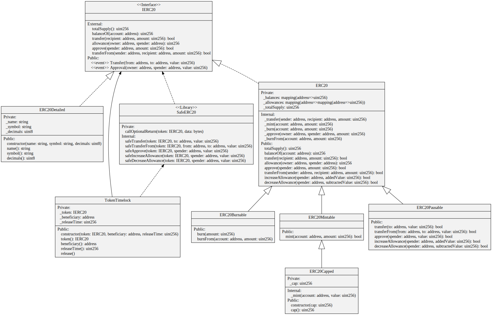

# Solidity 2 UML
[Unified Modeling Language (UML)](https://en.wikipedia.org/wiki/Unified_Modeling_Language) [class diagram](https://en.wikipedia.org/wiki/Class_diagram) generator for [Solidity](https://solidity.readthedocs.io/) contracts.

## Install

The following installation assumes [Node.js](https://nodejs.org/en/download/) has already been installed which comes with [Node Package Manager (NPM)](https://www.npmjs.com/).

Check out the repository from GitHub and npm install the dependencies
```Bash
git clone https://github.com/naddison36/solidity-diagram-gen.git
npm install
```

## Usage

To see the usage options
```Bash
$ node sol2uml.js -h

Usage: sol2uml [options] <file or root folder>

Generates UML diagrams from Solidity source code

Options:
  -v, --verbose         With debugging statements
  -o, --output [value]  File outputs: svg, png or both (default: "svg")
  -h, --help            output usage information

```

To generate the test contracts in this repo
```Bash
$ node sol2uml.js ./contracts
```

To generate a SVG diagram of all Solidity files under some root folder. The output will be a `diagram.svg` file in the working folder.
```Bash
$ node sol2uml.js path/to/contracts/root/folder
```

To generate a SVG diagram of all contracts in a single Solidity file. The output will be a `diagram.svg` file in the working folder.
```Bash
$ node sol2uml.js path/to/contracts/root/folder/solidity/file.sol
```

To generate SVG and PNG diagrams of all Solidity files under some root folder.  The output will be `diagram.svg` and `diagram.png` files in the working folder.
```Bash
$ node sol2uml.js -o both path/to/contracts/root/folder
```

## Examples

### Open Zeppelin ERC20 Tokens

[Source folder for version 2.1.2](https://github.com/OpenZeppelin/openzeppelin-solidity/tree/v2.1.2/contracts/token/ERC20)

### Open Zeppelin Access

[Source folder for version 2.1.2](https://github.com/OpenZeppelin/openzeppelin-solidity/tree/v2.1.2/contracts/access)

### MakerDAO's SAI Token

[Source file](https://github.com/bokkypoobah/MakerDAOSaiContractAudit/blob/master/audit/deployed-contracts/DSTokenSai-0x89d24A6b4CcB1B6fAA2625fE562bDD9a23260359.sol)

### IDEX

[Source file](https://github.com/AuroraDAO/idex)

## UML Syntax

Good online resources for learning UML
* [UML 2 Class Diagramming Guidelines](http://www.agilemodeling.com/style/classDiagram.htm)
* [Creating class diagrams with UML](https://www.ionos.com/digitalguide/websites/web-development/class-diagrams-with-uml/)

### Terminology differences

A Solidity variable becomes an attribute in UML and a Solidity function becomes an operation in UML.

### Stereotypes

#### Class stereotypes
* interface
* abstract
* library

#### Operarotor stereotypes

* event
* modifier
* fallback

### Visibility of Class attributes and operations
* \+ denotes public or external
* \- denotes private
* \# denotes internal

### UML Relationships

The most concise explanation of the [What is the difference between association, aggregation and composition](https://stackoverflow.com/questions/885937/what-is-the-difference-between-association-aggregation-and-composition/34069760#34069760).

The following UML relationships are used in Solidity terms:
* Association contract A has a storage variable of contract or interface B. The variable will exist beyond the transaction in the smart contract.
* Dependency contract, interface or library A has a memory variable of class B. This can be a function parameter, return parameter or function variable. The variable will no longer exist beyond the transaction.
* Generalisation contract or interface A inherits from contract, interface or abstract contract B
* Composition 
* Aggregation

Note a class in the above can also be an Interface, Abstract class or Library.

## About

This is a fork of the Richard Ramos's [solidity-diagram-gen](https://github.com/richard-ramos/solidity-diagram-gen) tool which no longer works as it uses [solidity-parser](https://www.npmjs.com/package/solidity-parser/v/0.4.0) which cannot handle newer Solidity syntax like `constructor`.

This version uses the [solidity-parser-antlr](https://github.com/federicobond/solidity-parser-antlr) Solidity parser which is built on top of [ANTLR4 grammar](https://github.com/solidityj/solidity-antlr4).

The diagrams are generated using [viz.js](https://github.com/mdaines/viz.js/) which uses [Graphviz](http://www.graphviz.org/) to render a [Scalable Vector Graphics (SVG)](https://en.wikipedia.org/wiki/Scalable_Vector_Graphics) file.

## TODO

* Document UML syntax
* Use new UML relationships
* Add dependencies from code blocks. ie uses on contracts within the functions
* enum support
* Option to specify a list of contracts to generate along with their dependencies. This was not all contracts in dependent libraries like Open Zeppelin need to be generated.
* Option to specify output location and file names
* Portrait output mode
* Add indicator for state mutability. eg view and pure functions
* Group contracts within a boundary. eg Open Zeppelin

